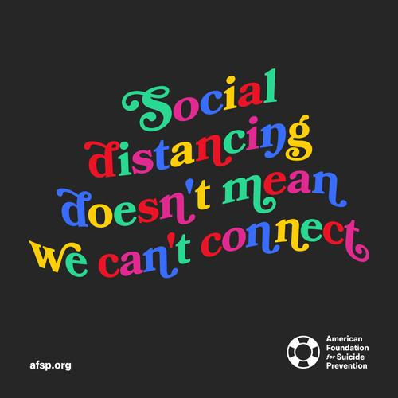

 

 

According to CDC website, in 2015, there were an estimated 43.4 million adults -- about 1 in 5 Americans aged 18 or older -- with a mental illness within the previous year. Among children and tees, about 20% -- 1 in 5 children -- have diagnosed with serious debilitating mental disorder. One serious consequence associated with mental illness is suicide. It is the 10th leading cause of death in the U.S. and the 2nd leading cause of death among people aged 15-34. 

This year is especially challenging for mental health because of the COVID-19 pandemic. As the number of cases of COVID-19 increases, so does the associated anxiety and depression. Thus, we would like to assess the risk factors related to mental health from pre-pandemic period as well as newly released datasets which illustrate the effects of COVID-19 on mental health.  

 

## Data Description

The main dataset used in this project is [500 Cities: Local Data for Better Health, 2019 release](https://chronicdata.cdc.gov/500-Cities/500-Cities-Local-Data-for-Better-Health-2019-relea/6vp6-wxuq). The 500 Cities project is a collaboration between CDC, the Robert Wood Johnson Foundation, and the CDC foundation. It aims to provide city and census tract-level small area estimates for chronic disease risk factors, health outcomes, and clinical preventive service use for the largest 500 cities in the United States. For this project, we used the complete dataset of the 500 Cities project 2019 release. It contains information recorded from 2016-2017. We filtered the original dataset so that it includes data for New York state. 

Besides the main dataset, we included two more datasets related to the impacts of COVID-19 on mental health. Those two datasets can be accessed through [Indicators of Anxiety or Depression COVID-19](https://data.cdc.gov/NCHS/Indicators-of-Anxiety-or-Depression-Based-on-Repor/8pt5-q6wp) and [Mental Health Care COVID-19](https://data.cdc.gov/NCHS/Mental-Health-Care-in-the-Last-4-Weeks/yni7-er2q). Both datasets are part of the Household Pulse Survey conducted by the U.S. Census Bureau, in collaboration with five federal agencies.

 

## Main Findings

* We found these risk factors had a strong, positive correlation with mental health: Current Smoking, Obesity, Physical Inactivity, and No Health Insurance.

* We found these risk factors had a strong, negative correlation with mental health: Dental Visit, Colorectal Cancer Screening, Core Preventive Services for Older Women, and Cholesterol Screening.

* From April 23nd to November 9th, the percentage of experiencing anxiety or depression mood was higher than the percentage of experiencing anxiety only or depression only.

* From August 19th to November 9th, the percentage of medication or therapy treatment was higher than the percentage of medication only, therapy only, or no therapy. 

 

## Website Overview

**Analysis**: Interactive plots for correlation of risk factors with mental health as well as the impacts of COVID-19 on mental health.

**NY Map**: An interactive map which you can explore different risk factors for mental health and its prevalence in NY state.

**Report**: A detailed analysis of the dataset, findings, and conclusions.

We also have a short screencast to walk you through the website. Please click [here](https://youtu.be/Wb6K_3rxqos): 

 
 
 
 

*If you are feeling down and need support during COVID-19 pandemic, please click [here](https://www.cdc.gov/coronavirus/2019-ncov/daily-life-coping/managing-stress-anxiety.html) or click the smile face in the navigation bar.*

 
 
 

### Contributors: 

* Danyang Gui | [Website](https://dgsv83.github.io/dgsv83hw4.github.io/)
* Jingyi Zhang | [Website](https://jingyi-z419.github.io/)
* Zihan Yu | [Website](https://zy2443.github.io/)
* Kexin Sun | [Website](https://keksin.github.io/)
* Yining Xiang |[Website](https://yiningx212.github.io/index.html)

